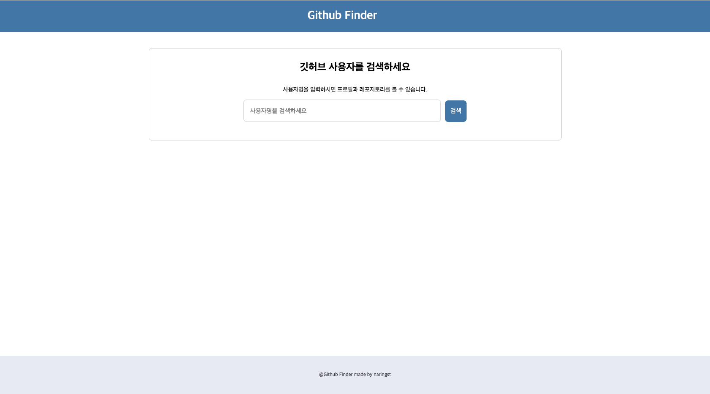
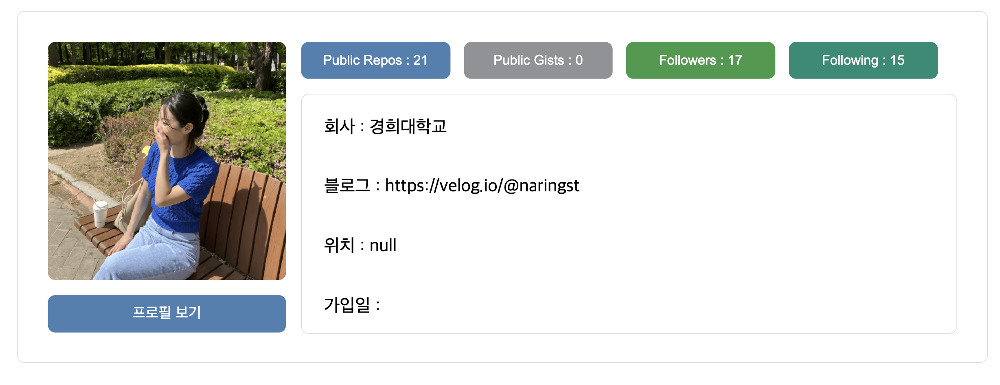
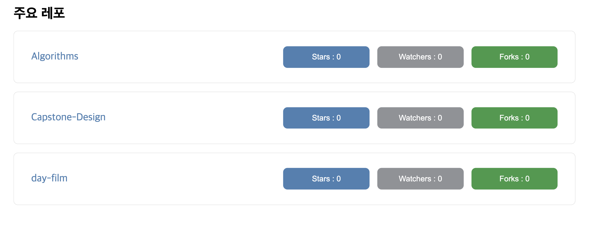

# Github-Finder

> 깃허브 사용자, 사용자 정보를 찾아주는 어플리케이션 👥

## 검색 기능

검색창에 깃허브 사용자 이름을 검색하면 레포지토리와 프로필 정보를 확인할 수 있습니다.

검색은 1. 검색 버튼을 통해서 2. 엔터 버튼을 활용해 가능합니다.

//영상1

//영상2

검색 시 **github api**를 활용해 해당 사용자의 정보를 fetch합니다.
fetch해오는 정보는 다음과 같습니다.

### 1. 프로필사진

프로필 사진을 가져오며, 프로필보기 버튼을 누르면 프로필 사진을 더 큰 사이즈로 확인할 수 있습니다.

### 2. 사용자 주요 정보

사용자의 Public Repo, Public Gists, Followers, Following 정보를 알 수 있습니다. 또한 소속 회사, 블로그 주소, 위치, 가입 날짜를 정보를 가져옵니다.

### 3. 주요 리포지토리

사용자의 주요 리포지토리 정보를 보여줍니다. 리포지토리 이름, star 수, watcher 수, fork 수를 보여줍니다.

